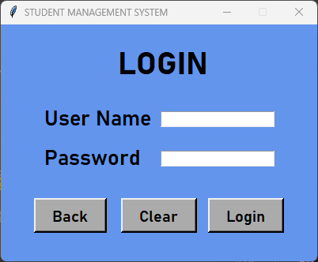
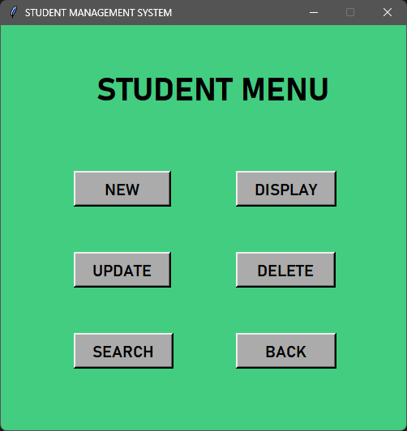
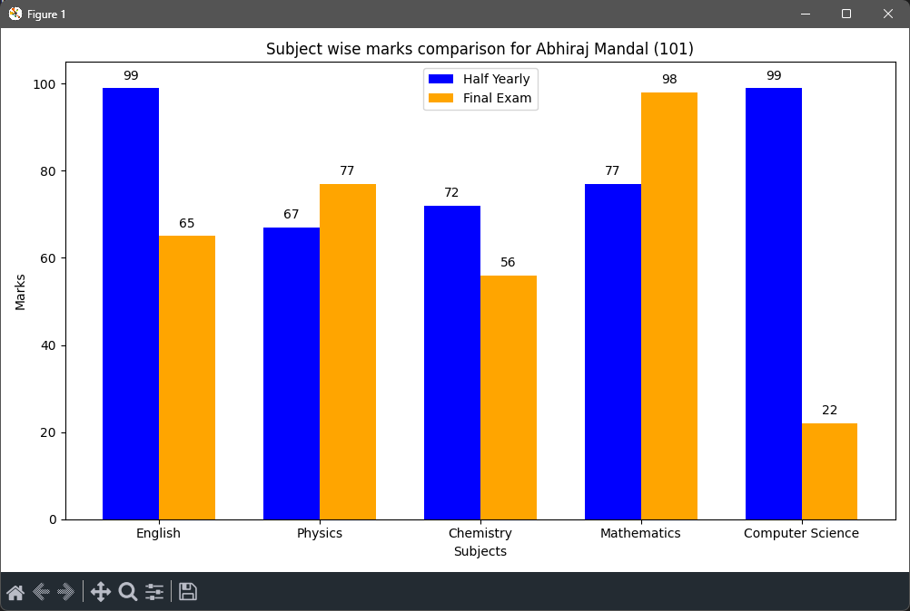
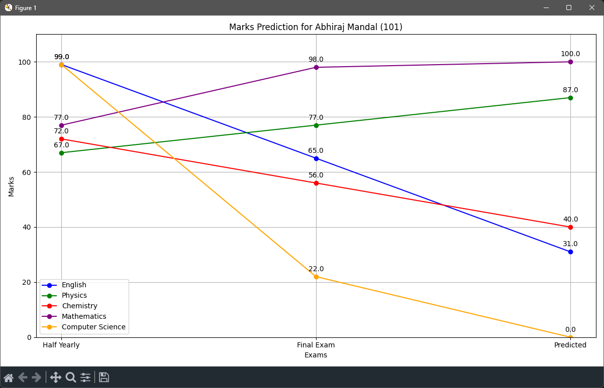

# Student Management System (SDBMS)

A comprehensive GUI-based application designed to manage student data, academic records, and performance analysis. Built using Python and MySQL, this system streamlines administrative tasks and provides advanced analytical features like marks prediction and report card generation.


## 📋 Table of Contents
- [About the Project](#about-the-project)
- [Key Features](#key-features)
- [Tech Stack](#tech-stack)
- [Screenshots](#screenshots)
- [Installation & Setup](#installation--setup)
- [Directory Structure](#directory-structure)
- [Future Improvements](#future-improvements)
- [Author](#author)

## 📖 About the Project
This project was developed as a Computer Science Class 12 project. It aims to digitize the manual process of handling student records. Unlike standard management systems, this application integrates **Machine Learning (Linear Regression)** to predict future student performance based on past exam trends and visualizes data using dynamic graphs.

## ✨ Key Features

### 1. User Authentication & Security
* Secure **Login/Register** system.
* Password encryption using **SHA-256 Hashing**.
* SQL Database connection verification at startup.

### 2. Student Management (CRUD)
* **Add New Students**: Auto-increments roll numbers to prevent duplication.
* **Search**: Dynamic search by Name, Class, Roll No, etc.
* **Update & Delete**: Modify student details or remove records securely.
* **Display**: View all student records in a tabular format.

### 3. Examination Management
* **Assign Subjects**: Map specific subjects to students.
* **Marks Entry**: Input marks for different exam terms (Half Yearly, Final).
* **Data Validation**: Ensures marks are within valid ranges (0-100).

### 4. Analytics & Reporting (Advanced)
* **Performance Graphs**: Uses `Matplotlib` to plot bar charts comparing Half Yearly vs. Final Exam performance.
* **Marks Prediction**: Uses `Scikit-Learn` (Linear Regression) to predict future marks based on previous performance trends.
* **Report Card Generation**: Generates a downloadable **PDF Report Card** using `ReportLab`.

## 🛠 Tech Stack

* **Language:** Python
* **Database:** MySQL
* **GUI Framework:** Tkinter
* **Data Visualization:** Matplotlib, NumPy
* **Machine Learning:** Scikit-Learn (LinearRegression)
* **PDF Generation:** ReportLab
* **Image Handling:** Pillow (PIL)
* **Security:** Hashlib

## 📸 Screenshots

| Login Screen | Student Menu |
|:---:|:---:|
|  |  |

| Data Visualization | Performance Prediction |
|:---:|:---:|
|  |  |

| PDF Report Card |
|:---:|
|  |

## ⚙️ Installation & Setup

### Prerequisites
* Python 3.x installed.
* MySQL Server installed and running.

### 1. Clone the Repository
```bash
git clone [https://github.com/NyteZoid/student-database-management-system.git](https://github.com/NyteZoid/student-database-management-system.git)
cd student-management-system
```

### 2. Install Dependencies
Run the following command to install all necessary Python libraries:
```bash
pip install mysql-connector-python pillow matplotlib numpy scikit-learn reportlab
```

### 3. Setup Assets
Ensure your directory includes the necessary `assets` folder:
* The `assets` folder must contain your required images (`logo_dps.png`, `dl.png`).
* The `users.json` file (which stores hashed user credentials) is created automatically upon the first user registration if it doesn't exist.

### 4. Database Configuration
The application automatically handles database and table creation:
1. Run the application.
```bash
python StudentManagementSystem.py
```
3. The initial prompt will ask for your MySQL Root Password.
4. Enter the password, and the system will automatically create the SDBMS database and the required tables (DATA, SUBJECTS, MARKS).

## 📂 Directory Structure

Student-Management-System/
├── assets/
│   ├── logo_dps.png       # School Logo asset
│   ├── dl.png             # Icon/decoration asset
│   └── users.json         # User credentials file (auto-generated)
├── screenshots/           # Images used in this README
├── StudentManagementSystem.py  # Main Source Code
└── README.md              # Project Documentation

## 👨‍💻 Author

Abhiraj Mandal
* Class 12 Computer Science student
* Delhi Public School, Prayagraj

Feel free to connect on https://www.linkedin.com/in/abhirajmandal/ to review this project!
